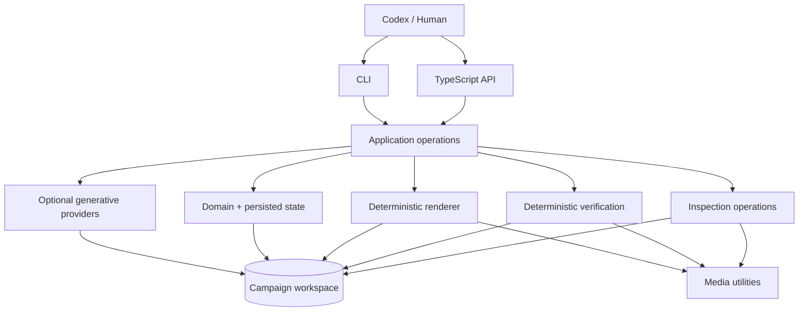

# Architecture

Videoer is a single TypeScript package with boundary-oriented modules. Codex and humans are external operators. They may use the CLI or call exported application operations; both paths share the same workflow logic.

Dependency direction keeps the CLI thin and prevents an embedded agent framework. `src/application` composes domain loading, templates, providers, rendering, inspection, and verification. Providers are the only generative boundary. Render and verification stay deterministic and cannot call providers.

Campaigns are durable filesystem workspaces. Original references and supplied/imported assets remain identifiable; generated assets are revisioned and retain prompt, provider, references, shot, attempt, request hash, path, and time. `campaign-state.json` records this provenance plus inspection/report references and lightweight render history. Render revisions use stable sequential IDs, optional parent IDs, changes, and an explicit draft/final kind. Draft quality may differ later; the lifecycle is represented now without pretending lower-cost rendering exists.

Selective regeneration is asset/shot scoped. A changed request produces a new cache identity and revision for that asset only. Rendering reuses valid persisted assets and does not invoke generation. This makes iterative inspection and rerendering cheap and prevents surprise paid work.

Verification and inspection are separate subsystems. Verification composes local evaluators into structured pass/warning/fail checks with stable IDs and actionable context. Inspection provides metadata, previews, sampled frames, shot-boundary frames, and contact sheets for qualitative Codex/human judgement. Current code implements campaign/storyboard checks, PNG/JPEG metadata inspection, ffprobe video metadata, and reusable contact-sheet arguments; frame extraction and artifact persistence will arrive with the renderer.
