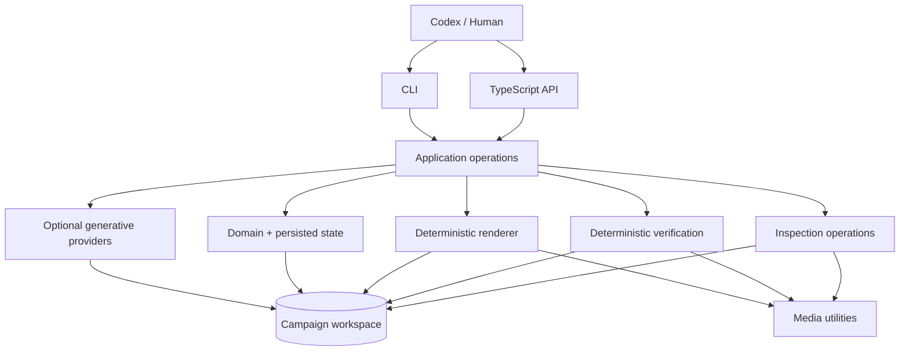

# Architecture

Videoer is a single TypeScript package with boundary-oriented modules. Codex and humans are external operators. They may use the CLI or call exported application operations; both paths share the same workflow logic.

Dependency direction keeps the CLI thin and prevents an embedded agent framework. `src/application` composes domain loading, templates, providers, rendering, inspection, and verification. Providers are the only generative boundary. Render and verification stay deterministic and cannot call providers.

Campaigns are durable filesystem workspaces. Original references and supplied/imported assets remain identifiable; generated assets are revisioned and retain prompt, provider, references, shot, attempt, request hash, path, and time. `campaign-state.json` records this provenance plus inspection/report references and lightweight render history. Render revisions use stable sequential IDs, optional parent IDs, changes, and an explicit draft/final kind. Drafts render at at most 540 pixels wide; finals use campaign delivery dimensions and update the recoverable `renders/final.mp4` alias while retaining their versioned file.

Selective regeneration is asset/shot scoped. A changed request produces a new cache identity and revision for that asset only. Rendering reuses valid persisted assets and does not invoke generation. This makes iterative inspection and rerendering cheap and prevents surprise paid work.

Verification and inspection are separate subsystems. Verification composes local evaluators into structured pass/warning/fail checks with stable IDs and actionable context. Inspection extracts a midpoint frame for every shot, media metadata, and a compact contact sheet for qualitative Codex/human judgement. Reports and inspection metadata are persisted and referenced from campaign state.

Rendering validates campaign/storyboard identity, resolves the typed template, embeds supplied local images or SVGs as deterministic data inputs, and maps shot timing and motion presets to Remotion compositions. Remotion supplies the browser composition runtime; its packages and Zod are exact-version pinned. FFmpeg-full supplies delivery codecs, probing, frame extraction, and contact-sheet processing. Neither boundary invokes a generative provider.

`scene-keyframes` extends this boundary without weakening it. Planning and explicit provider operations persist an anchor plus related dependent frames with continuity instructions and per-keyframe revisions. The renderer loads those accepted files, applies an overlapping blend and one scene-level camera move, and remains provider-free. See [Scene keyframes](scene-keyframes.md) and [ADR 015](adr/015-scene-keyframes.md).
