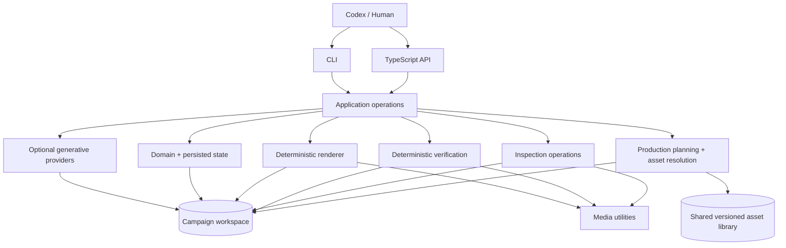

# Architecture

Videoer is a single TypeScript package with boundary-oriented modules. Codex and humans are external operators. They may use the CLI or call exported application operations; both paths share the same workflow logic.

Current policy is [`product-principles.md`](product-principles.md): optimise for finished-video quality per unit of cost and effort, pick whichever production technique gets there, and treat renderer independence, cross-campaign transfer, and shared-library publication as optional engineering leverage rather than universal requirements. See [ADR 072](adr/072-pragmatic-production-realignment.md) for what that narrows in the description below — nothing described here was removed, but several paragraphs describe an available, chosen implementation rather than a mandatory path.

Videoer supports more than one production path, chosen per shot or per campaign. The ordinary storyboard path (below) drives images/video/text/scene shots through Remotion/PixiJS with no 3D involved at all — this is what `projects/the-rise-of-demons` uses end to end, and it is a fully legitimate way to produce a finished cinematic-feeling trailer. The declarative cinematic-campaign path (later in this document) additionally offers Blender-backed 3D production — characters, environments, physically simulated VFX — for shots that need it. Neither path is the "real" architecture; both are.

Dependency direction keeps the CLI thin and prevents an embedded agent framework. `src/application` composes domain loading, templates, providers, rendering, inspection, and verification. Providers are the only generative boundary. Render and verification stay deterministic and cannot call providers.

Campaigns are durable filesystem workspaces. Original references and supplied/imported assets remain identifiable; generated assets are revisioned and retain prompt, provider, references, shot, attempt, request hash, path, and time. `campaign-state.json` records this provenance plus inspection/report references and lightweight render history. Render revisions use stable sequential IDs, optional parent IDs, changes, and an explicit draft/final kind. Drafts render at at most 540 pixels wide; finals use campaign delivery dimensions and update the recoverable `renders/final.mp4` alias while retaining their versioned file.

Selective regeneration is asset/shot scoped. A changed request produces a new cache identity and revision for that asset only. Rendering reuses valid persisted assets and does not invoke generation. This makes iterative inspection and rerendering cheap and prevents surprise paid work.

Verification and inspection are separate subsystems. Verification composes local evaluators into structured pass/warning/fail checks with stable IDs and actionable context. Inspection extracts a midpoint frame for every shot, media metadata, and a compact contact sheet for qualitative Codex/human judgement. Reports and inspection metadata are persisted and referenced from campaign state.

Rendering validates campaign/storyboard identity, resolves the typed template, embeds supplied local images or SVGs as deterministic data inputs, and maps shot timing and motion presets to Remotion compositions. Remotion supplies the browser composition runtime; its packages and Zod are exact-version pinned. FFmpeg-full supplies delivery codecs, probing, frame extraction, and contact-sheet processing. Neither boundary invokes a generative provider.

First-class `scene` shots add a renderer-independent composition graph between storyboard and Remotion. Depth-sorted image/video/text/shape/sprite/particle/effect layers receive independent timing, transforms, masks, blend modes, filters, and camera parallax. A central registry routes ordinary layers to React and dense procedural layers to PixiJS/WebGL. Remotion still owns timeline and final composition; Pixi is a replaceable 2D backend. See [Scene composition and VFX](scene-vfx.md), [renderer backends](renderer-scene-backends.md), and [ADR 016](adr/016-scene-composition-pixi-vfx.md).

`scene-keyframes` extends this boundary without weakening it. Planning and explicit provider operations persist an anchor plus related dependent frames with continuity instructions and per-keyframe revisions. The renderer loads those accepted files, applies an overlapping blend and one scene-level camera move, and remains provider-free. See [Scene keyframes](scene-keyframes.md) and [ADR 015](adr/015-scene-keyframes.md).

The cinematic production control plane sits before executable scene construction. `production-plan.yaml` expresses shots, actions, continuity, direction, and typed asset requirements without backend classes. Resolution queries the shared asset library and writes `asset-manifest.yaml` with explicit reuse/adapt/create decisions. Assets use stable domain IDs, immutable semantic versions, provenance, licence clearance, capabilities, compatibility, artifacts, and verification state. Every verified/deprecated artifact and verification file is content-addressed. Declarative derivation contracts cover geometry, gait, layered performance, atmospheric VFX, surface materials, fitted clothing, non-speech audio, and lighting rigs. They preserve domain-specific invariants, record live parent/target/derived hashes, and are independently revalidated during approval. Renderer-independent material contracts are embedded at geometry bindings and translated into deterministic Blender shader nodes; fitted wardrobe remains a separate entity synchronized to its actor. Animated long dresses additionally pass CPU-skinned temporal collision, silhouette, and local-strain gates; deterministic pose-space corrections are persisted as ordinary morph targets/tracks and cached by garment/body/motion content hashes. Renderer-independent executable scene manifests then compose those assets with semantic entity placement, transforms, retimed/layered motion, cameras, lights, resolved atmosphere, landmarks, and fail-closed motion/blocking/render gates before Blender rendering. See [ADR 017](adr/017-autonomous-production-architecture.md), [ADR 018](adr/018-shared-asset-library.md), [ADR 027](adr/027-executable-cinematic-scene-contract.md), [ADR 029](adr/029-cross-domain-derived-asset-contracts.md), [ADR 030](adr/030-renderer-independent-temporal-clothing.md), [ADR 031](adr/031-deterministic-audio-treatment-derivation.md), [ADR 032](adr/032-first-class-lighting-derivation.md), the [scene contract](cinematic-scenes.md), and the [cinematic system progress record](progress/cinematic-system.md).

Campaign benchmarks are fixtures and reference examples, not the architecture, and not a gate a new campaign must pass through. Named campaign factories may demonstrate composition, but domain contracts should not depend on a campaign ID, character, location, fixed coordinates, editorial copy, or one trailer grammar where avoiding that dependency is cheap — this keeps reusable code reusable, not because a second campaign is required to prove it. A materially different campaign reusing the same public operations is welcome, optional evidence that a contract generalised; it is not required for a campaign, or the system, to be considered done. See [ADR 028](adr/028-benchmark-as-conformance-suite.md) as narrowed by [ADR 072](adr/072-pragmatic-production-realignment.md).

Cross-campaign transfer is available, optional evidence, not a required property. A campaign may reuse the same public application operations as another, and a derived asset may be published and directly resolved by a different campaign, when that reuse is worth the engineering cost. Rainwalk Square adapts and publishes verified VFX, material, and clothing parents; Rainwalk Banner consumes those exact versions in a 16:9 two-second edit with zero domain adaptation. This is a useful demonstration that the publication mechanics work, not a requirement every campaign must repeat.

Semantic shot assembly resolves camera positions and targets from attachment names owned by geometry assets, then applies the entity's complete world transform. Reusable templates therefore ask for roles such as `product-focus` and `camera-three-quarter`, not bookshop or cover coordinates. The generic product-reveal template is exercised by both the benchmark book cover and the unrelated Beacon One device campaign; missing attachment contracts fail before rendering.

New multi-shot productions use the [declarative cinematic campaign contract](declarative-cinematic-campaigns.md). One validated file may define procedural geometry, library-backed adaptations, semantic attachments and entity placement, generated/library/layered motion, shots, camera bindings, reusable lighting rigs plus supplemental lights, resolved or generated editorial overlays, atmosphere, deterministic audio, subject-aware render gates, and exact delivery. The application layer interprets this data generically; campaign-specific orchestration modules are not required. The complete eight-shot reference benchmark now uses this boundary, and its former named scene/audio/edit factories have been removed.

The following two paragraphs describe the project-owned character/skeleton/motion system as originally built. Per [ADR 074](adr/074-mpfb-rigify-is-the-production-human.md) the production human is now MPFB's hm08 CC0 mesh + a Rigify rig, and human motion is authored against the Rigify rig; the owned body, canonical production skeleton, and procedural gait below are retired-for-production and kept only until a migration removes or repoints them. Read them as history.

Procedural motion is authored as renderer-independent designs with named phases, contact targets, composable pose layers, invariants, parameters, and research provenance. Generic curve, composition, point-contact, joint-limit, kinematic-analysis, and visual-review modules feed canonical clips; Blender is the production adapter (Three.js can structurally convert the same canonical clip data, exercised only by `test/geometry.test.ts` today — see [ADR 073](adr/073-three-js-is-a-conversion-utility-not-a-backend.md)). The first implementation is an eight-phase, heel-to-toe, proportion-aware human gait with neutral, cautious, and confident parameter sets. Acceptance evaluates the analytic solver, reconstructs the final persisted clip at 401 poses, measures 240 Hz C² velocity/acceleration/jerk behavior against a healthy-gait-calibrated policy, and requires a hash-bound side and three-quarter visual review. Mechanical success cannot imply visual acceptance, and changed evidence makes a review stale. See [ADR 024](adr/024-research-grounded-phase-motion-synthesis.md), the [human gait research record](research/human-gait.md), and the [kinematic calibration](research/human-gait-kinematics.md).

Spoken performance uses the same renderer-independent boundaries. Geometry assets carry sparse named morph targets, motion clips carry scalar morph-weight tracks, and motion timelines compose masked facial and skeletal layers with measurable contribution. Declarative speech cues are the single source for persisted WAV audio and facial timing: the open-source eSpeak NG runtime renders audio while a project-owned native callback bridge records exact phoneme events from the same text, voice, rate, and pitch. The builder maps those events to canonical English visemes on the campaign frame grid, rejects incompatible character geometry, clipped cues, and AV placement drift beyond one frame, and drives the same Blender shape keys (Three.js morph attributes are structurally exercised in `test/geometry.test.ts` only — no live scene drives them; see [ADR 073](adr/073-three-js-is-a-conversion-utility-not-a-backend.md)). See [speech installation and diagnostics](install-speech.md).

Non-speech audio treatment is also a derivation domain rather than a campaign-owned FFmpeg graph. A typed contract selects an exact verified-parent interval; bounds EQ, compression, width, fades, loudness, and peak; and may add deterministic tonal/noise accents on exact 48 kHz samples. Publication repeats the complete render from the live parent and requires a byte-identical output plus temporal-envelope and accent-contribution evidence. Beacon One publishes the first treatment and Last Platform resolves it unchanged. See [ADR 031](adr/031-deterministic-audio-treatment-derivation.md).

Cinematic finishing is a renderer-independent VFX dependency applied after 3D rendering and editorial overlays. Profiles bound tonal treatment, thresholded bloom, vignette and seeded grain; the FFmpeg backend preserves exact delivery topology and acceptance independently requires byte-identical warm/cool transfer rerenders. Scene fingerprints include the profile hash, and declarative campaigns resolve verified profiles through ordinary library requirements. Finishing may unify a delivery, but cannot substitute for lighting, materials or exposure. See [ADR 053](adr/053-renderer-independent-cinematic-finishing.md).

Lighting rigs are first-class library assets rather than environment metadata. A bounded derivation may transform the entire rig in space, resize emitters, rebalance declared roles, and recolour light/world energy while preserving topology, identity, purpose, order, and coherent exposure. Approval recomputes the expected rig from live definitions and requires source plus unrelated-environment visual evidence. Nocturne/gallery and warm-interior rigs are joined by a first-class dusk/warm-practical rig transferred from the old city into the night-transit platform. See [reusable cinematic lighting](lighting.md) and [ADR 032](adr/032-first-class-lighting-derivation.md).

Portable architectural systems own explicit host contracts and named installation points instead of being fused into one environment mesh. Real wall-opening modules require the host grammar to leave a physical aperture; rainwater modules require a compatible facade/eave span and preserve a physically open collection channel. Cross-host evidence reuses the exact portable geometry, while acceptance inspects live host and asset triangles rather than trusting reports. See [ADR 042](adr/042-real-host-aperture-architectural-modules.md), [ADR 044](adr/044-portable-open-rainwater-systems.md), and [procedural environments](environments.md).

Non-flat dressing placement is bound to live geometry rather than a nominal ground height. A request identifies the exact surface asset, slope limit, offset and alignment policy; the provider must carry the same asset identity. The solver records the supporting triangle, measured normal and slope for every accepted instance and rejects unsupported or over-steep candidates. See [ADR 048](adr/048-geometry-bound-surface-placement.md).

Environment illumination extends the existing reusable lighting rig through an explicit schema-v2 package: HDR/EXR radiance is bound to its complete verified source manifest and evidence, portable adaptation restages every transitive byte without overwrite, scenes compose exact rig-owned emitters with distinct shot-local practicals, and fingerprints cover the complete package. Blender consumes an orientation-tested directional world mapping and a finite all-frame-contained fog volume that never occupies World Output Volume. Cycles remains the authoritative image-based-lighting renderer until an Eevee probe-bake contract exists. See [ADR 059](adr/059-provenance-bound-environment-illumination.md).

Living set dressing reuses that placement contract rather than introducing a vegetation-only scatterer. Potted plants remain independent props with foliage anchors; an explicit-version family adds authored clusters, navigation exclusions and required-variant coverage. The generic lanceolate-leaf primitive provides a reusable medium-distance leaf edge and tip without renderer curves or ellipsoid proxies. See [ADR 049](adr/049-surface-bound-vegetation-families.md).

Inhabited merchandising is also an authored relationship rather than anonymous scatter. Market structures, baskets and provision sacks remain independently reusable assets; a family recipe places physical inventory on named counter and stock heights while preserving customer circulation. Cluster offsets are renderer-independent metres and do not drift when a member receives bounded scale variation. Shared family acceptance owns identity, evidence and metadata promotion, while domain wrappers retain genuinely specific checks such as live terrain support or complete merchandising. See [ADR 050](adr/050-physical-market-merchandising-families.md).

Authored workstations extend the same family boundary to functional interiors. A request can require named recipes before weighted optional clusters, so a bench, populated tool board and rolling parts cabinet retain their working relationship and operator clearance. Cross-host acceptance also reconstructs bounded lighting treatments from the live verified warm-interior parent instead of fusing illumination into the family. See [ADR 052](adr/052-authored-workshop-workstations.md).

Secondary atmosphere resolves from named attachments on live source geometry rather than shot-local coordinates or renderer objects. Smoke, ember and dust layers share deterministic source, lifetime, motion and extent semantics while retaining kind-specific physical parameters. The initial analytic smoke representation remains visually rejected and unpublished; the source-binding architecture is retained for a future turbulent volumetric/fluid backend. See [ADR 051](adr/051-source-bound-secondary-atmosphere.md).

Portable signage additionally separates verified facade hardware from campaign-owned face content. The content contract bounds two physical faces and permits replacement without leaking campaign copy or renderer texture objects into generic mounting code. Acceptance proves live content triangles exist on both sides and verifies host height/clearance independently. See [ADR 045](adr/045-portable-projecting-signage.md).

Layered projecting canopies expose stable rainwater and underside-practical anchors rather than absorbing drainage and lights into one opaque roof asset. Their construction and drainage contracts preserve physical fall, covering inventory, support topology, and host clearance independently of Blender modifiers. This lets a campaign compose verified window, canopy, gutter, sign, and light assets into one facade while retaining individual provenance and replacement boundaries. See [ADR 046](adr/046-layered-projecting-canopy-systems.md).

Temporal practical lights use source-appropriate discriminated modulation rather than one generic flicker label. Combustion sources may vary through bounded black-body temperature, while electrical instability preserves authored emitter colour and varies only bounded intensity/dropout behaviour. Every modulated emitter must prove exact useful-light scaling, and any visible source must share that same signal. The portable neon blade sign is the first non-flame transfer proof. See [ADR 047](adr/047-authored-colour-electrical-practical-modulation.md).

Editorial identities are first-class library assets rather than campaign-local text commands. A bounded derivation may change canvas, safe area, copy, palette, motif opacity, and responsive type scale while preserving the parent's exact font and motif contract. Build and approval independently rerender the transparent overlay, measure every line against its safe area, verify contrast and the live font digest, and bind the candidate to the current campaign source. Nocturne publishes the first editorial release; a separate programme-announcement campaign resolves it unchanged. See [ADR 034](adr/034-first-class-editorial-derivation-and-transfer.md).

Semantic camera paths are executable contracts rather than endpoint hints. The renderer and pre-render verifier share normalized position, target, lens, and easing semantics; Blender tracks an animated target rather than interpolating derived Euler rotations. Declared `camera-path-clearance` gates test the real transformed or animated/skinned obstacle triangles, and every render records backend-versus-contract error at semantic frames. See [ADR 033](adr/033-semantic-camera-path-fidelity-and-clearance.md).

The autonomous campaign loop is a persisted state machine rather than a manual recipe. It writes a pre-build plan, fingerprints live scene dependencies, selectively renders stale shots, blocks assembly on objective failures, and requires an accountable current-hash qualitative review before completion. Authoritative Blender evidence uses fixed-seed Cycles CPU through lossless frames and deterministic project-owned encoding; Eevee Next is preview-only on platforms where its shadow path is not bit-repeatable. See [ADR 035](adr/035-autonomous-campaign-production-loop.md) and [ADR 036](adr/036-deterministic-blender-render-profiles.md).

Pixel invalidation and evidence invalidation are distinct. The render hash excludes landmarks, gates, and descriptive metadata; the evidence hash includes them. Evidence-only refresh loads the exact scene through Blender without rendering frames, recomputes evaluated camera/projection evidence, extracts semantic frames from the hash-verified existing MP4, and reruns gates. This preserves expensive valid pixels while refusing to preserve a review whose evidence contract changed.

Speech creation and reuse are separate contracts. Creation persists one isolated WAV and one native event ledger before motion or soundtrack assembly; the mixer consumes that exact WAV rather than synthesizing a second copy. Publication independently parses and verifies the live geometry, motion, WAV, and event data in addition to re-hashing every artifact and dependency. Downstream campaigns resolve verified audio through `audio-source` cues and declare an audiovisual binding between the audio cue, facial motion, target geometry, and global edit placement. This makes reuse fail closed without tying the audio subsystem to one character, sentence, or campaign grammar.
